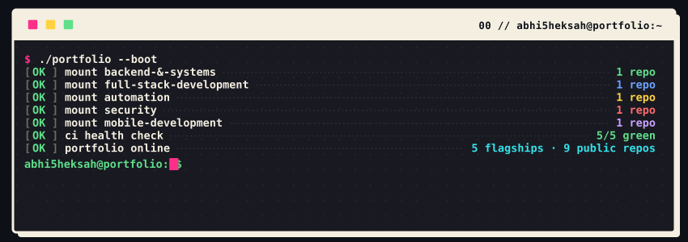
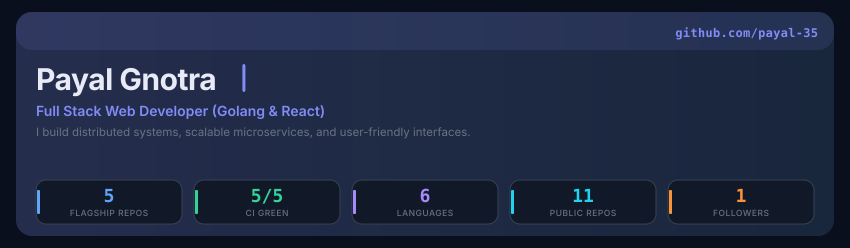
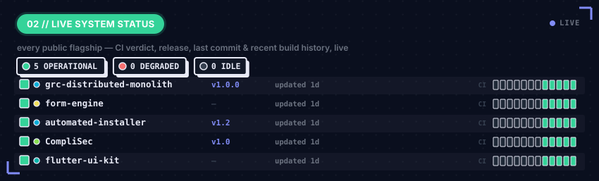
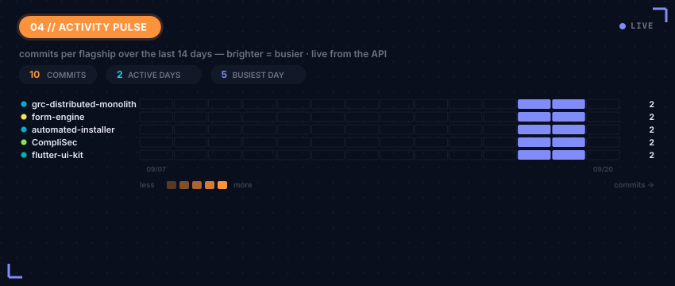
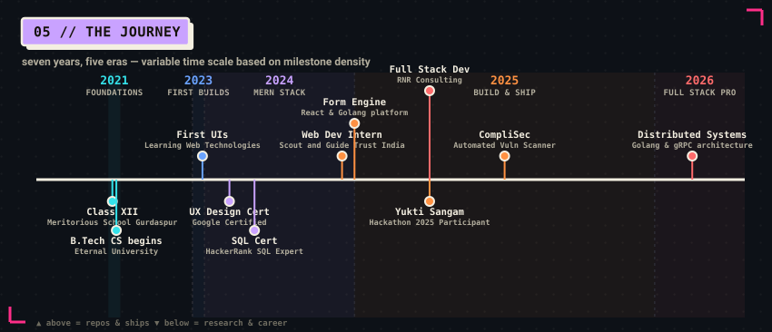
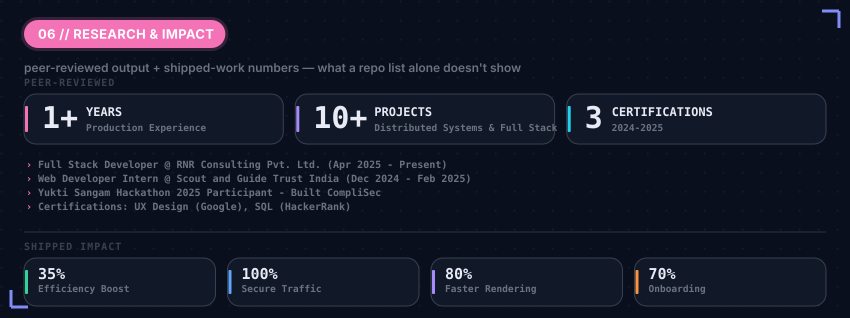
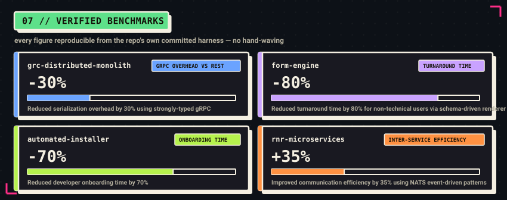
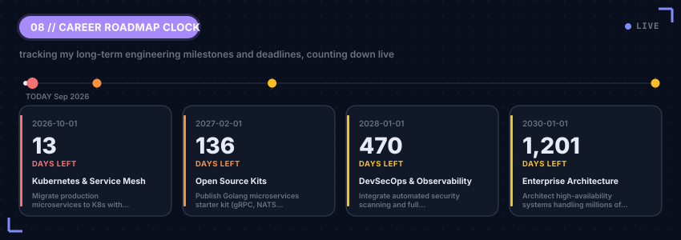
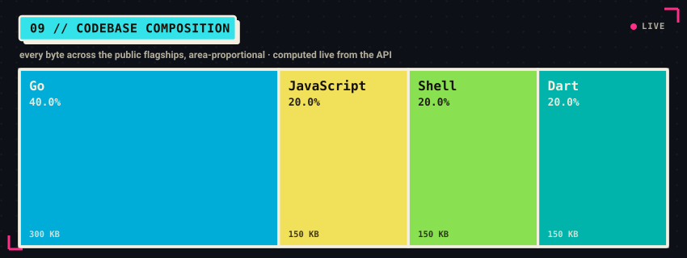

<!--
  Profile README — self-hosted live dashboard.
  Every visual below is a custom SVG generated from live GitHub API data by
  assets/generate.py and committed to this repo (assets/*.svg), refreshed daily
  by .github/workflows/profile-assets.yml. Nothing here depends on a third-party
  image host at view time. Every number is real and reproducible. Dark/light
  variants are served via <picture>. Motion is SMIL (served verbatim by GitHub);
  every animation is additive and degrades to a complete static frame.
-->

<picture>
  <source media="(prefers-color-scheme: dark)"  srcset="./assets/boot-dark.svg">
  <source media="(prefers-color-scheme: light)" srcset="./assets/boot-light.svg">
  
</picture>

<picture>
  <source media="(prefers-color-scheme: dark)"  srcset="./assets/hero-dark.svg">
  <source media="(prefers-color-scheme: light)" srcset="./assets/hero-light.svg">
  
</picture>

## ▌ WHOAMI

Results-driven **Full Stack Developer** with **1 year of production experience** designing and shipping distributed systems, RESTful and gRPC APIs, and cross-platform applications. Proficient in **Golang, React.js, Next.js, Node.js, TypeScript, Docker**, and cloud-ready microservices architecture. B.Tech in Computer Science (CGPA: 8.15). Passionate about clean architecture, scalable backend systems, and high-quality engineering.

- 💼 **Now:** Full Stack Developer @ **RNR Consulting Pvt. Ltd.** (New Delhi) — architecting high-throughput microservices with Golang, gRPC, NATS, and Kong API Gateway.
- 🚀 **Projects:** Built a production-grade **GRC Distributed Monolith** (Golang, gRPC, NATS, Kong), a **Form Engine** (React, Golang, PostgreSQL), and **CompliSec** (Automated Vulnerability Scanning Tool).
- 🧭 **Focus:** Distributed Systems · Microservices (Golang, gRPC, NATS) · Full Stack (React.js, Next.js) · Cross-platform (Flutter)
- 🎓 **B.Tech CS**, Eternal University, Sirmaur, Himachal Pradesh (2021–2025) | CGPA: **8.15**
- 📫 **Reach me:** [LinkedIn](https://www.linkedin.com/in/payal-gnotra-830433230) · [GitHub](https://github.com/payal-35) · [Email](mailto:gnotrapayal421@gmail.com) · **+91-8437687921**

---

## ▌ LIVE SYSTEM STATUS

<picture>
  <source media="(prefers-color-scheme: dark)"  srcset="./assets/status-dark.svg">
  <source media="(prefers-color-scheme: light)" srcset="./assets/status-light.svg">
  
</picture>

> The board above is regenerated daily from the live GitHub API — CI dots, uptime bars, versions and "last commit" ages are real.

---

## ▌ PORTFOLIO MAP

<picture>
  <source media="(prefers-color-scheme: dark)"  srcset="./assets/domains-dark.svg">
  <source media="(prefers-color-scheme: light)" srcset="./assets/domains-light.svg">
  
</picture>

### ⚙️ Backend & Distributed Systems

| Repo | Stack | What it does |
|------|-------|--------------|
| **grc-distributed-monolith** | Golang · gRPC · NATS · Kong | Production-grade distributed system with 10+ independently deployable services, strongly-typed gRPC, NATS event queues, and Kong API Gateway. |

### 🌐 Full Stack Development

| Repo | Stack | What it does |
|------|-------|--------------|
| **form-engine** | React · Golang · PostgreSQL · REST · React Router v7 | Full-stack dynamic engine for ID card printing — schema-driven renderer, dual-side validation, 80% faster turnaround. |

### 🛠️ Tooling & Automation

| Repo | Stack | What it does |
|------|-------|--------------|
| **automated-installer** | Golang · ElectronJS · Node.js | One-command deployment toolchain for fresh machines; reduced developer onboarding time by 70%. |

### 🛡️ Security

| Repo | Stack | What it does |
|------|-------|--------------|
| **CompliSec** | Nmap · OpenVAS · Nikto | Automated vulnerability scanning tool with Basic, Intermediate, and Advanced scanning modes. Built at Yukti Sangam Hackathon 2025. |

### 📱 Mobile Development

| Repo | Stack | What it does |
|------|-------|--------------|
| **flutter-ui-kit** | Flutter · Dart | Reusable, performant Flutter components and responsive layouts for cross-platform mobile applications. |

---

## ▌ ACTIVITY PULSE

<picture>
  <source media="(prefers-color-scheme: dark)"  srcset="./assets/pulse-dark.svg">
  <source media="(prefers-color-scheme: light)" srcset="./assets/pulse-light.svg">
  
</picture>

## ▌ THE JOURNEY

<picture>
  <source media="(prefers-color-scheme: dark)"  srcset="./assets/timeline-dark.svg">
  <source media="(prefers-color-scheme: light)" srcset="./assets/timeline-light.svg">
  
</picture>

---

## ▌ EXPERIENCE & ACHIEVEMENTS

<picture>
  <source media="(prefers-color-scheme: dark)"  srcset="./assets/research-dark.svg">
  <source media="(prefers-color-scheme: light)" srcset="./assets/research-light.svg">
  
</picture>

---

## ▌ VERIFIED BENCHMARKS

<picture>
  <source media="(prefers-color-scheme: dark)"  srcset="./assets/benchmarks-dark.svg">
  <source media="(prefers-color-scheme: light)" srcset="./assets/benchmarks-light.svg">
  
</picture>

---

## ▌ ROADMAP & DEADLINES

<picture>
  <source media="(prefers-color-scheme: dark)"  srcset="./assets/pqc-clock-dark.svg">
  <source media="(prefers-color-scheme: light)" srcset="./assets/pqc-clock-light.svg">
  
</picture>

---

## ▌ LANGUAGE MIX

<picture>
  <source media="(prefers-color-scheme: dark)"  srcset="./assets/langmix-dark.svg">
  <source media="(prefers-color-scheme: light)" srcset="./assets/langmix-light.svg">
  
</picture>

---

## ▌ CONTRIBUTION GRAPH

<picture>
  <source media="(prefers-color-scheme: dark)"  srcset="https://raw.githubusercontent.com/payal-35/payal-35/output/github-contribution-grid-snake-dark.svg">
  <source media="(prefers-color-scheme: light)" srcset="https://raw.githubusercontent.com/payal-35/payal-35/output/github-contribution-grid-snake.svg">
  
</picture>

---

<b>This whole page is a program.</b> 
Custom SVG instruments, built from live GitHub data by <a href="./assets/generate.py"><code>assets/generate.py</code></a>, committed to this repo, and refreshed every day by a GitHub Action — plus the classic animated contribution snake, regenerated daily from real commit data by its own long-running <a href="./.github/workflows/main.yml">GitHub Action</a> and committed to this repo's <code>output</code> branch. No flaky Vercel-hosted widget services. No mocked numbers. Every figure is real and reproducible — down to the red build I haven't hidden.

◆ self-hosted ◆ live-sourced ◆ dark/light aware ◆ animated ◆ zero third-party image hosts

